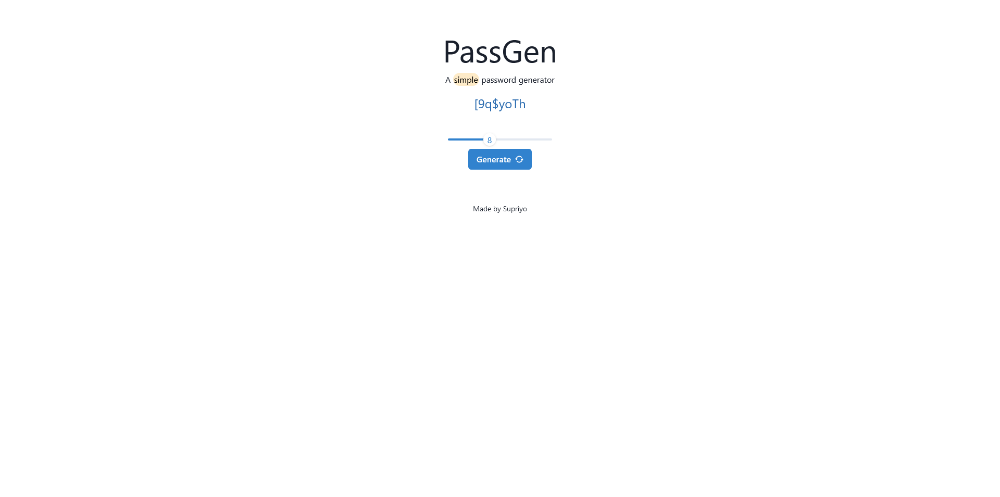

# PassGen

A simple and secure password generator.


## Tech Stack

**Client:** ReactJS, Chakra-UI


## Screenshots




## Run Locally

Clone the project

```bash
  git clone https://github.com/supr1yo/passgen
```

Go to the project directory

```bash
  cd passgen
```

Install dependencies

```bash
  npm install
```

Start the server

```bash
  npm run dev
```


## License

[MIT](https://choosealicense.com/licenses/mit/)

